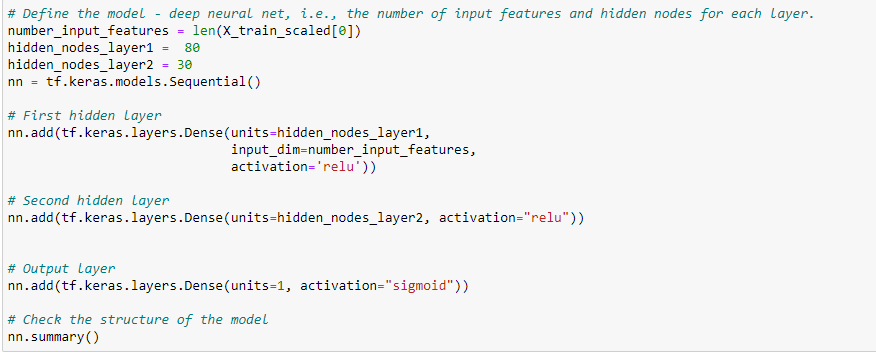
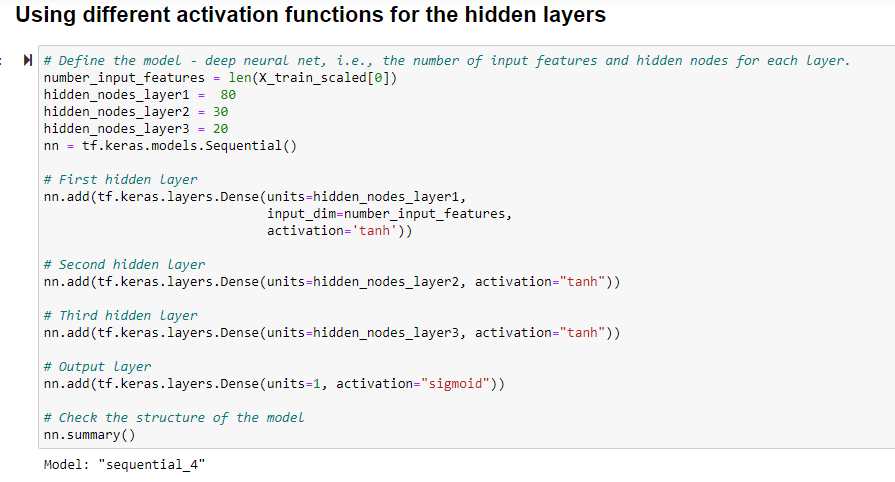
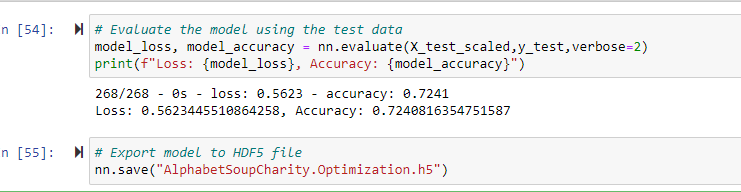

# Overview of the analysis: 

In this project I will be create a binary classifier that is capable of predicting whether applicants will be successful if funded 
by Alphabet Soup. The datset is a  CSV containing more than 34,000 organizations that have received funding from Alphabet Soup over 
the years. Within this dataset are a number of columns that capture metadata about each organization.

# Results

## Data Preprocessing:

- What variable(s) are considered the target(s) for your model?

  The target variable that I considered was **IS_SUCCESSFUL**

- What variable(s) are considered to be the features for your model?
  
  The features variables that I considered are all the columns, except the columns that are droped, i.e., **EIN** and **NAME** columns
  
- What variable(s) are neither targets nor features, and should be removed from the input data?
  
  The columns that are being dropped are **EIN** and **NAME** 
  
## Compiling, Training, and Evaluating the Model:

- **How many neurons, layers, and activation functions did you select for your neural network model, and why?**
  
  - At first, there's an input features and two hidden layers. The first hidden layer has 80 neurons and the second hidden layer has 30 neurons.
    The activation function for both hidden layers is **relu** and for the output layer is **sigmoid**. I used relu function because it's allows the 
    network to converge very quickly, but ReLu function should not be used for the hidden layers. Whereas I used Sigmoid function for the output
    layer as it generally work better in the case of classification problems.
  
   
  
  - I also tried the model with 3 hidden layers using **tanh** activation function for the hidden layers and **sigmoid** function for the output
    layer. The first hidden layer was of 80 neurons, the second with 30 neurons and third with 20 neurons.
  
  
 
  
- **Were you able to achieve the target model performance?**

  - The target for the model was to be 75% or above, which I couldn't achieve.

  

- **What steps did you take to try and increase model performance?**

  - To increase the model performance, I added another hidden layer and used a different activation function for the hidden layers.

  
  
# Summary:

In this project I was working towards achieving the target model performance of 75%, however it could not be achieved. I reached close 
and was able to achieve the performance of 72%. I tried different steps, i.e., adding additional layers, changing the activation function
to improve the performnace. 